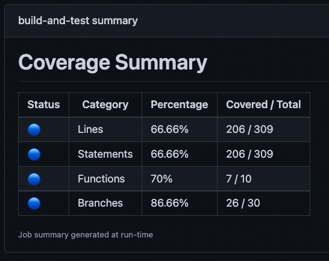
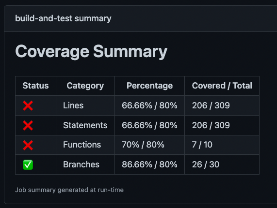
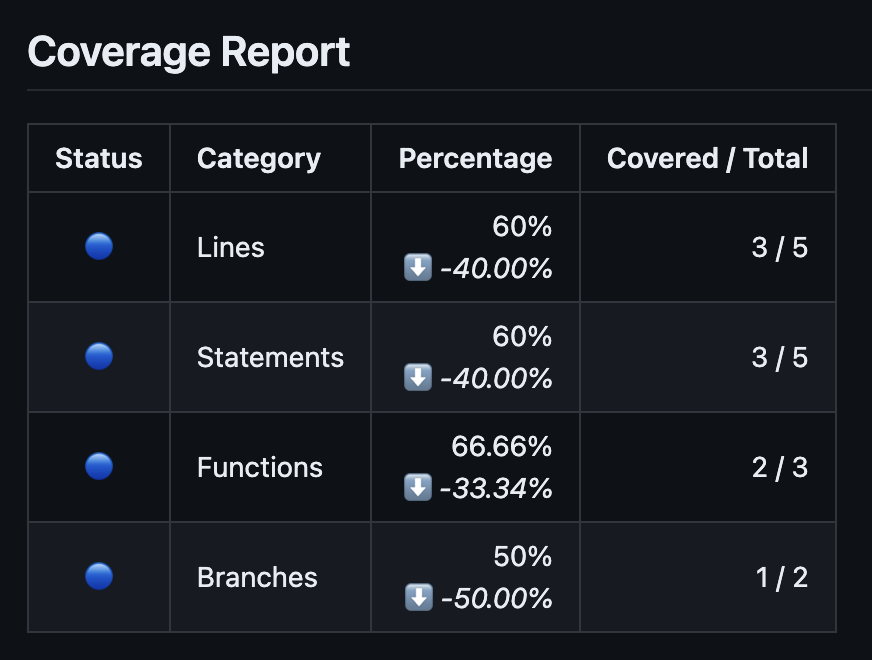

# vitest-coverage-report-action

This GitHub Action reports [vitest](https://vitest.dev/) coverage results as a GitHub step-summary and as a comment on a pull request.



The action generates a high-level coverage summary for all coverage categories, as well as a detailed, file-based report. The report includes links to the files themselves and the uncovered lines for easy reference.

Want to contribute? Check out the [Contributing Guidelines](./CONTRIBUTING.md).

## Usage

To use this action, you need to configure `vitest` to create a coverage report with the following reporters:

- `json-summary` (required): This reporter generates a high-level summary of your overall coverage.
- `json` (optional): If provided, this reporter generates file-specific coverage reports for each file in your project.

You can configure the reporters in your Vite configuration file (e.g., `vite.config.js`) as follows:

```js
import { defineConfig } from 'vite';

export default defineConfig({
  test: {
    coverage: {
      // you can include other reporters, but 'json-summary' is required, json is recommended
      reporter: ['text', 'json-summary', 'json'],
      // If you want a coverage reports even if your tests are failing, include the reportOnFailure option
      reportOnFailure: true,
    }
  }
});
```

Then execute `npx vitest --coverage.enabled true` in a step before this action.

### Example Workflow

```yml
name: 'Test'
on: 
  pull_request:

jobs:
  test:
    runs-on: ubuntu-latest
    
    permissions:
      # Required to checkout the code
      contents: read
      # Required to put a comment into the pull-request
      pull-requests: write

    steps:
    - uses: actions/checkout@v4
    - name: 'Install Node'
      uses: actions/setup-node@v4
      with:
        node-version: '20.x'
    - name: 'Install Deps'
      run: npm install
    - name: 'Test'
      run: npx vitest --coverage.enabled true
    - name: 'Report Coverage'
      # Set if: always() to also generate the report if tests are failing
      # Only works if you set `reportOnFailure: true` in your vite config as specified above
      if: always() 
      uses:  davelosert/vitest-coverage-report-action@v2
```

> [!NOTE]
> To enable comments on pull requests originating from forks, please refer to the configuration provided in the [Working with Pull Requests from Forks](#working-with-pull-requests-from-forks) section.

### Required Permissions

This action requires the `pull-requests: write` permission to add a comment to your pull request. If you're using the default `GITHUB_TOKEN`, ensure that you include both `pull-requests: write` and `contents: read` permissions in the job. The `contents: read` permission is necessary for the `actions/checkout` action to checkout the repository. This is particularly important for new repositories created after GitHub's [announcement](https://github.blog/changelog/2023-02-02-github-actions-updating-the-default-github_token-permissions-to-read-only/) to change the default permissions to `read-only` for all new `GITHUB_TOKEN`s.

### Options

| Option                      | Description                                                                                                                                                                                                                                                      | Default                                                                                                                                                                                                                                                            |
| --------------------------- | ---------------------------------------------------------------------------------------------------------------------------------------------------------------------------------------------------------------------------------------------------------------- | ------------------------------------------------------------------------------------------------------------------------------------------------------------------------------------------------------------------------------------------------------------------ |
| `working-directory`         | The main path to search for coverage- and configuration files (adjusting this is especially useful in monorepos).                                                                                                                                                | `./`                                                                                                                                                                                                                                                               |
| `json-summary-path`         | The path to the json summary file.                                                                                                                                                                                                                               | `${working-directory}/coverage/coverage-summary.json`                                                                                                                                                                                                              |
| `json-final-path`           | The path to the json final file.                                                                                                                                                                                                                                 | `${working-directory}/coverage/coverage-final.json`                                                                                                                                                                                                                |
| `json-summary-compare-path` | The path to the json summary file to compare against. If given, will display a trend indicator and the difference in the summary. Respects the `working-directory` option.                                                                                       | undefined                                                                                                                                                                                                                                                          |
| `vite-config-path`          | The path to the vite config file. Will check the same paths as vite and vitest                                                                                                                                                                                   | Checks pattern `${working-directory}/vite[st].config.{t\|mt\|ct\|j\|mj\|cj}s`                                                                                                                   |
| `github-token`              | A GitHub access token with permissions to write to issues (defaults to `secrets.GITHUB_TOKEN`).                                                                                                                                                                  | `${{ github.token }}`                                                                                                                                                                                                                                              |
| `file-coverage-mode`        | Defines how file-based coverage is reported. Possible values are `all`, `changes` or `none`.                                                                                                                                                                     | `changes`                                                                                                                                                                                                                                                          |
| `file-coverage-root-path`   | The root (or absolute) part of the path used within the json coverage reports to point to the covered files. You can change this if your reports were generated in a different context (e.g., a docker container) and the absolute paths don't match the current runner's workspace. Uses the runner's workspace path by default. | `${{ github.workspace }}`                                                                                                                                                                                                                                          |
| `name`                      | Give the report a custom name. This is useful if you want multiple reports for different test suites within the same PR. Needs to be unique.                                                                                                                     | ''                                                                                                                                                                                                                                                                 |
| `pr-number`                 | The number of the PR to post a comment to. When using the `push` trigger, you can set this option to "auto" to make the action automaticaly search of a PR with a matching `sha` value and comment on it.                                                                                                                                                                                                              | If in the context of a PR, the number of that PR.<br/> If in the context of a triggered workflow, the PR of the triggering workflow.                                                                    <br/>If no PR context is found, it defaults to `undefined` |
| `comment-on`                | Specify where you want a comment to appear: "pr" for pull-request (if one can be found), "commit" for the commit in which context the action was run, or "none" for no comments. You can provide a comma-separated list of "pr" and "commit" to comment on both. | `pr`                                                                                                                                                                                                                                                               |

#### File Coverage Mode

- `changes` - show Files coverage only for project files changed in that pull request (works only with `pull_request`, `pull_request_review`, `pull_request_review_comment` actions)
- `all` - show it grouped by changed and not changed files in that pull request (works only with `pull_request`, `pull_request_review`, `pull_request_review_comment` actions)
- `none` - do not show any File coverage details (only total Summary)

#### Name

If your project includes multiple test suites and you want to consolidate their coverage reports into a single pull request comment, you must assign a unique `name` to each action step that parses a summary report. For example:

```yml
## ...
    - name: 'Report Frontend Coverage'
      if: always() # Also generate the report if tests are failing
      uses:  davelosert/vitest-coverage-report-action@v2
      with:
        name: 'Frontend'
        json-summary-path: './coverage/coverage-summary-frontend.json'
        json-final-path: './coverage/coverage-final-frontend.json
    - name: 'Report Backend Coverage'
      if: always() # Also generate the report if tests are failing
      uses:  davelosert/vitest-coverage-report-action@v2
      with:
        name: 'Backend'
        json-summary-path: './coverage/coverage-summary-backend.json'
        json-final-path: './coverage/coverage-final-backend.json'
```

### Coverage Thresholds

> [!WARNING]
> Currently, this action does not import the vite-configuration, but parses it as string to extract the coverage-thresholds by an regexp. In other words: All thresholds need to be directly defined in the config-file given to this action through the vite-config-path input. E.g., when using workspace to extend a parent-configuration, the thresholds can not be defined in the parent-config.

This action reads the coverage thresholds specified in the `coverage` property of the Vite configuration file. It then uses these thresholds to determine the status of the generated report.

For instance, consider the following configuration:

```typescript
import { defineConfig } from 'vite';

export default defineConfig({
  test: {
    coverage: {
      thresholds: {
        lines: 60,
        branches: 60,
        functions: 60,
        statements: 60
      }
    }
  }
});
```

With the above configuration, the report would appear as follows:



If no thresholds are defined, the status will display as '🔵'.

### Coverage Trend Indicator

By using the `json-summary-compare-path` option, the action will display both a trend indicator and the coverage difference in the summary. This feature is particularly useful for tracking changes between the main branch and a previous run.



The most straightforward method to obtain the comparison file within a pull request is to run the tests and generate the coverage for the target branch within a matrix job:

```yml
name: "Test"
on:
  pull_request:

jobs:
  test:
    runs-on: ubuntu-latest
    strategy:
      matrix:
        include:
          - branch: main
            artifact: main
          - branch: ${{ github.head_ref }}
            artifact: pull-request

    permissions:
      # Required to checkout the code
      contents: read

    steps:
      - uses: actions/checkout@v4
        with:
          ref: ${{ matrix.branch }}
          ## Set repository to correctly checkout from forks
          repository: ${{ github.event.pull_request.head.repo.full_name }}
      - name: "Install Node"
        uses: actions/setup-node@v4
        with:
          node-version: "20.x"
      - name: "Install Deps"
        run: npm install
      - name: "Test"
        run: npx vitest --coverage.enabled true
      - name: "Upload Coverage"
        uses: actions/upload-artifact@v4
        with:
          name: coverage-${{ matrix.artifact }}
          path: coverage

  report-coverage:
    needs: test
    runs-on: ubuntu-latest
    steps:
        ## Check out the repository to obtain the vitest.config file
      - uses: actions/checkout@v4
      - name: "Download Coverage Artifacts"
        uses: actions/download-artifact@v4
        with:
          name: coverage-pull-request
          path: coverage
      - uses: actions/download-artifact@v4
        with:
          name: coverage-main
          path: coverage-main
      - name: "Report Coverage"
        uses: davelosert/vitest-coverage-report-action@v2
        with:
          json-summary-compare-path: coverage-main/coverage-summary.json
```

### Workspaces

If you're using a monorepo with [Vitest Workspaces](https://vitest.dev/guide/workspace.html) and running Vitest from your project's root, Vitest will disregard the `coverage` property in individual project-level Vite configuration files. This is because some [configuration options](https://vitest.dev/guide/workspace.html#configuration), such as coverage, apply to the entire workspace and are not allowed in a project config.

In such cases, you can create a Vite configuration file at the root of your project, alongside your `vitest.workspace.js` file, to configure coverage for the entire workspace:

```js
import { defineConfig } from 'vite';

export default defineConfig({
  test: {
    coverage: {
      // you can include other reporters, but 'json-summary' is required, json is recommended
      reporter: ['text', 'json-summary', 'json'],
    }
  }
});
```

Alternatively, you can supply [coverage options](https://vitest.dev/config/#coverage) directly to the CLI using dot notation:

```sh
npx vitest --coverage.enabled --coverage.provider=v8 --coverage.reporter=json-summary --coverage.reporter=json
```

### Working with pull requests from forks

Due to security considerations, GitHub Actions does not provide workflows originating from a fork with write access to your repository, even if such permissions are configured. Consequently, this action cannot comment on these pull requests using the above-documented configuration.

For more information on why this is the case, refer to the following article:
[Preventing Pwn-Requests](https://securitylab.github.com/research/github-actions-preventing-pwn-requests/).

However, you can circumvent this limitation by dividing your workflow into two separate workflows (see examples below):

1. **Testing Workflow**: This workflow runs tests in response to the `pull_request` trigger, within the context of the actual pull request, and uploads the coverage reports as artifacts.

2. **Reporting Workflow**: This workflow is triggered upon the completion of the **Testing Workflow** using the `workflow_runs` event. It downloads and parses the coverage report, and posts a comment on the pull request.

> [!IMPORTANT]
> The **Reporting Workflow** must reside within your default branch (as specified in [GitHub's workflow_run documentation](https://docs.github.com/en/actions/using-workflows/events-that-trigger-workflows#workflow_run))

This action will automatically detect:

- If it is being run within a `workflow_run` trigger
- If the triggering workflow was a pull request

It will then automatically locate the appropriate pull request to comment on.

#### Example

- **test.yml**

    ```yml
    name: "Test"
    on:
      pull_request:

    jobs:
      test:
        runs-on: ubuntu-latest

        permissions:
          contents: read

        steps:
          - uses: actions/checkout@v4
          - name: "Install Node"
            uses: actions/setup-node@v4
            with:
              node-version: "20.x"
          - name: "Install Deps"
            run: npm install
          - name: "Test"
            run: npx vitest --coverage.enabled true

          - name: "Upload Coverage"
            uses: actions/upload-artifact@v4
            with:
              name: coverage
              path: coverage
    ```

- **coverage.yml** (has to be on the default branch)

    ```yml
    name: Report Coverage

    on:
      workflow_run:
        workflows: ["Test"]
        types:
          - completed

    jobs:
      report:
        runs-on: ubuntu-latest

        permissions:
          pull-requests: write

        steps:
          - uses: actions/checkout@v4
          - uses: actions/download-artifact@v4
            with:
              github-token: ${{ secrets.GITHUB_TOKEN }}
              run-id: ${{ github.event.workflow_run.id }}
          - name: "Report Coverage"
            uses: davelosert/vitest-coverage-report-action@v2
    ```

> [!NOTE]
> This configuration also works for pull requests originating from your own repository (not forks), so it can be used generally.

> [!NOTE]
> If you see an error like: `Error: Unable to download artifact(s): Resource not accessible by integration` you may need to add the `actions: read` permission to the `coverage.yml` reporting action.

#### Limitations & Considerations

This approach has a few limitations:

- The **Reporting Workflow** is only triggered after the **Testing Workflow** completes. As a result, there will be a (most likely neglectable) delay before a comment appears on the pull request.
- To obtain the pull request number from a forked pull request, it's necessary to iterate over all pull requests in the repository using the [Pulls REST API](https://docs.github.com/en/rest/pulls/pulls?apiVersion=2022-11-28#list-pull-requests) and match it by the `head_sha`. This is due to the `github` context of the triggering workflow not containing the pull request information ([see this discussion](https://github.com/orgs/community/discussions/25220)). While this is generally not an issue, it could cause delays if the repository is large and the pull request is significantly old.
- Since the **Reporting Workflow** runs in the context of your repository's default branch, changes to your coverage threshold won't be reflected in the pull request comment. This can be mitigated by also uploading the Vite config as an artifact in the **Testing Workflow**.
