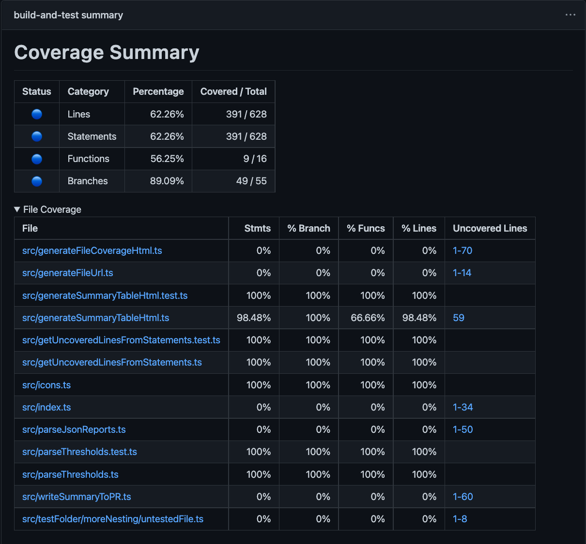

# vitest-coverage-report-action

A GitHub Action to report [vitest](https://vitest.dev/) coverage results as a GitHub step-summary and Pull-Request comment.



## Usage

This action requires you to use `vitest` to create at least `json-summary` and optionally a `json` reporter (required for specific line-coverage report).

You can configure those within the `vitest.config.js` file:

```js
import { defineConfig } from 'vite';

export default defineConfig({
  test: {
    coverage: {
      // you can include other reporters, but 'json-summary' is required, json is recommended
      reporter: ['text', 'json-summary', 'json'],
    }
  }
});
```

### Example Workflow

```yml
name: 'Test'
on: 
  pull_request:

jobs:
  test:
    runs-on: ubuntu-latest
    steps:
    - uses: actions/checkout@v2
    - name: 'Install Node'
      uses: actions/setup-node@v2
      with:
        node-version: '16.x'
    - name: 'Install Deps'
      run: npm install
    - name: 'Test'
      run: npx vitest --coverage.report json-summary
    - name: 'Report Coverage'
      if: always() # Also generate the report if tests are failing
      uses:  davelosert/vitest-coverage-report-action@v1
```

### Options

| Option            | Description                                                                                      | Default                            |
| ----------------- | ------------------------------------------------------------------------------------------------ | ---------------------------------- |
| json-summary-path | The path to the json summary file. Uses "coverage/coverage-summary.json" by default.             | `./coverage/coverage-summary.json` |
| json-final-path   | The path to the json final file. Uses "coverage/coverage-final.json" by default.                 | `./coverage/coverage-final.json`   |
| vite-config-path  | The path to the vite config file. Uses "vite.config.js" by default.                              | `./vitest.config.js`               |
| github-token      | A github access token with permissions to write to issues. Uses secrets.GITHUB_TOKEN by default. | `./vitest.config.js`               |

### Coverage Thresholds

This action will read the coverage thresholds defined in the `coverage`-property of the `vite.config.js`-file and mark the status of the generated report accordingly.

E.g. with a config like this:

```typescript
import { defineConfig } from 'vite';

export default defineConfig({
  test: {
    coverage: {
      lines: 80,
      branches: 80,
      functions: 80,
      statements: 80
    }
  }
});
```

the report would look like this:


## Current Status

This is a work in progress project. Currently, it will only take an already created `json-summary`-report, convert it to markdown and export it to:

1. a comment within an associated pull-request (if there is one)
2. the [GitHub Step Summary](https://docs.github.com/en/actions/learn-github-actions/environment-variables#default-environment-variables) of the current action

### Future Plans

- [x] Make summary file configurable
- [ ] Also report detailed file-coverage (coverage per file and unconvered lines) based on the `json`-Reporter
- [ ] Invoke 'vitest' directly from the action
- [ ] Also provide test results (failed tests etc.) in the generated markdown reports
- [ ] Add option to let the action fail if coverage thresholds are not met
- [ ] Also report test results themselves
- [ ] Beatufiy the report with better markdown
