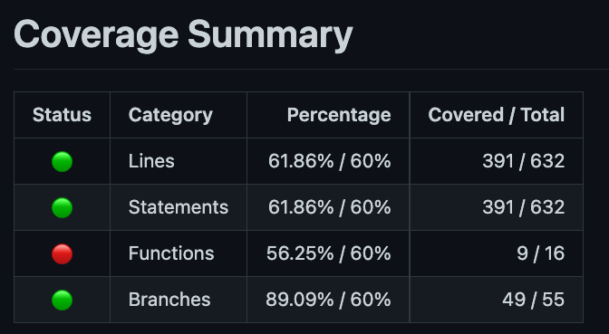

# vitest-coverage-report-action

A GitHub Action to report [vitest](https://vitest.dev/) coverage results as a step-summary and PR comment.


## Usage

This action requires you to use `vitest` to create a `json-summary` report as `coverage/coverage-summary.json` (will be configurable in the future) before invoking the action. You can do this by either running `vitest` like this:

```shell
npx vitest run --coverage.reporter json-summary
```

Or by adding the configuration to you `vitest.config.js`-File:

```js
import { defineConfig } from 'vite';

export default defineConfig({
  test: {
    coverage: {
      // you can include other reporters, but 'json-summary' is required
      reporter: ['text', 'json-summary'],
    }
  }
});
```

### Example Workflow

```yml
name: 'Test'
on: 
  pull_request:

jobs:
  test:
    runs-on: ubuntu-latest
    steps:
    - uses: actions/checkout@v2
    - name: 'Install Node'
      uses: actions/setup-node@v2
      with:
        node-version: '16.x'
    - name: 'Install Deps'
      run: npm install
    - name: 'Test'
      run: npx vitest --coverage.report json-summary
    - name: 'Report Coverage'
      if: always() # Also generate the report if tests are failing
      uses:  davelosert/vitest-coverage-report-action@v1
```

### Coverage Thresholds

This action will read the coverage thresholds defined in the `coverage`-property of the `vitest.config.js`-File and mark the status of the generated report accordingly.

E.g. with a config like this:

```typescript
import { defineConfig } from 'vite';

export default defineConfig({
  test: {
    coverage: {
      lines: 80,
      branches: 80,
      functions: 80,
      statements: 80
    }
  }
});
```

the report would look like this:



## Current Status

This is a work in progress project. Currently, it will only take an already created `json-summary`-reporter, convert it to markdown and export that to:

1. a comment within an associated pull-request (if there is one)
2. the [GitHub Step Summary](https://docs.github.com/en/actions/learn-github-actions/environment-variables#default-environment-variables)

### Future Plans

- [ ] Also report detailed file-coverage (coverage per file and unconvered lines) based on the `json`-Reporter
- [ ] Make summary file configurable
- [ ] Invoke 'vitest' directly from the action
- [ ] Also provide test results (failed tests etc.) in the generated markdown reports
- [ ] Add option to let the action fail if coverage thresholds are not met
- [ ] Also report test results themselves
